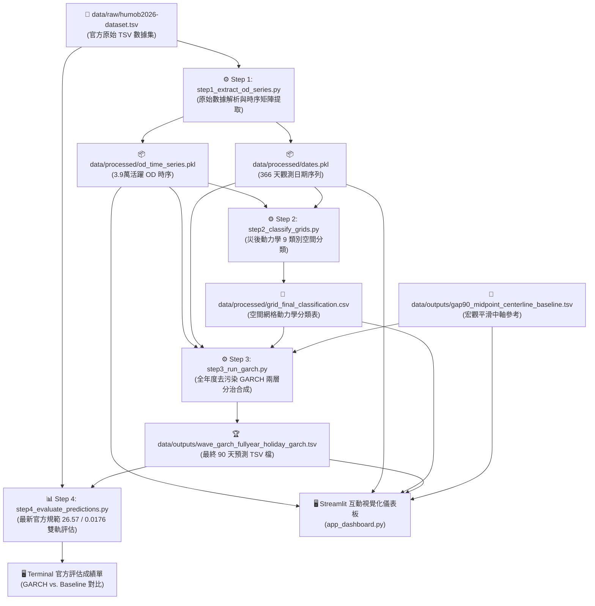

# 🌊 HuMob 2026：從原始數據 (Raw Data) 到最終預測成果的完整處理流程指南

本文件詳細說明本專案如何從官方提供的原始 TSV 數據集出發，歷經時序矩陣提取、空間動力學特徵工程、去污染 GARCH 分層合成，最終產出符合官方評測標準之預測結果與互動視覺化儀表板的全流程。

---

## 🗺️ 全域流水線架構圖 (End-to-End Workflow)



---

## 📁 檔案與資料夾對照目錄

```
humob2026_garch/
├── data/
│   ├── raw/
│   │   └── humob2026-dataset.tsv           # 官方原始 TSV 數據集 (2023/11 ~ 2024/10)
│   ├── processed/
│   │   ├── od_time_series.pkl              # 步驟 1 產出：全域活躍 OD 稠密時間序列矩陣
│   │   ├── dates.pkl                       # 步驟 1 產出：歷史有效觀測日期清單
│   │   ├── grid_final_classification.csv   # 步驟 2 產出：能登半島空間網格 9 大動力學分類
│   │   └── isolated_top_error_od_pairs.csv # 儀表板輔助：支配全域 MSE 之 Top 首惡 OD 清單
│   └── outputs/
│       ├── wave_garch_fullyear_holiday_garch.tsv  # 步驟 3 產出：GARCH 最終 90 天預測檔
│       └── gap90_midpoint_centerline_baseline.tsv # 基準模型：宏觀平滑 Baseline 預測檔
│
├── src/
│   ├── __init__.py
│   ├── japan_calendar.py                  # 日本國定假日、假日前夕與連假狀態判定模組
│   └── data_loader.py                     # TSV 檔案解析與空間 Bounding Box 邊界過濾模組
│
├── step1_extract_od_series.py             # 步驟 1：原始數據 ➔ 整理為連續 OD 時序矩陣
├── step2_classify_grids.py                # 步驟 2：災後 1 月衝擊期動力學網格分類
├── step3_run_garch.py                     # 步驟 3：執行 GARCH 兩層分治波形動態合成 (產出 90 天預測)
├── step4_evaluate_predictions.py          # 步驟 4：最新官方規範 (26.57 / 0.0176) 嚴格評估
│
├── run_full_pipeline.py                   # 🚀 一鍵端到端流水線執行腳本 (步驟 1 ➔ 4)
├── app_dashboard.py                       # 🖥️ 獨立 Streamlit 互動視覺化儀表板
├── requirements.txt                       # Python 相依套件清單
├── GARCH_MATHEMATICAL_MODEL.md            # 📐 Step 3 完整數學模型架構說明書
├── README.md                              # 專案快速啟動說明
└── DATA_PROCESSING_PIPELINE.md            # 本處理流程詳細技術說明文件
```

---

## 🔬 詳細階段處理流程 (Phase-by-Phase Deep Dive)

### 階段 0：原始資料特徵與空間定義 (Raw Data Specification)

* **數據來源**：`data/raw/humob2026-dataset.tsv`
* **資料格式**：TSV 格式，每行結構為：
  > `Date \t { Origin_Grid: { Destination_Grid: Flow_Value } }`
* **空間範圍 (Bounding Box)**：
  - X 範圍：30 ~ 70，共 41 欄
  - Y 範圍：35 ~ 70，共 36 列
  - 空間網格總數：`41 × 36 = 1,476` 個網格。
  - **對角線停留 (Diagonal Stay Flow)**：1,476 個網格內部停留（佔總人流 90% 以上，均值 26.57 人）。
  - **非對角線跨區 (Off-Diagonal Flow)**：`1,476 × 1,475 = 2,177,100` 個跨區流動對（99% 以上真實值為 0，均值 0.0176 人）。
* **時間範圍與盲區**：
  - 總時間跨度：2023/11/01 至 2024/10/31（共 366 天，閏年含 2/29）。
  - **90 天盲區預報期**：2024/02/01 至 2024/04/30（競賽主要評估 4 月份）。
  - **官方排除日 (16 天)**：包含系統異常觀測日，計算錨點均值與評估時自動剔除。

---

### 步驟 1：原始數據解析與 OD 時序矩陣提取 (`step1_extract_od_series.py`)

#### 1. 核心任務
原始 TSV 數據以每日巢狀字典字串的稀疏形式儲存，無法直接進行時序建模。本步驟負責建立跨全年 366 天的連續稠密矩陣。

#### 2. 處理流程
1. **字串安全修復與解析**：TSV 中的 `: NA` 缺失標記轉換為 Python `None`，並以安全 eval 還原為字典。
2. **全域活躍 OD 路線掃描 (Active OD Pairs)**：
   - 遍歷全年觀測，凡流量 > 0 之 OD 路線加入集合，共提煉出 **約 3.9 萬條活躍 OD 路線**（含外部區域 `-1_-1`）。
3. **稠密時序矩陣對齊**：
   - 針對每條活躍 OD，建立長度等於有效觀測天數的 float 陣列，未觀測到的日期標記為 `NaN`。
4. **輸出**：序列化為二進位快取檔 `od_time_series.pkl` 與 `dates.pkl`（讀取速度比純文字快 10 倍以上）。

---

### 步驟 2：災後動力學空間網格分類 (`step2_classify_grids.py`)

#### 1. 核心任務
2024/01/01 能登半島地震對不同地理網格造成截然不同的影響（避難所人流湧入 vs. 嚴重受災區人流驟降）。本步驟對各網格進行動力學行為特徵分類。

#### 2. 分類演算法規則
提取各網格的對角線停留流量 (g-g)，比較**震前基準期**（`< 2024/01/01`）與**震後衝擊期**（`2024/01/01 ~ 2024/01/31`）之日均流量：

| 動力學類別 | 判斷條件 | 物理現象與行為意涵 |
| :--- | :--- | :--- |
| **Persistent Zero** | `Pre < 0.5` 且 `Jan < 0.5` | 極偏遠或非活躍網格，全年幾無人流 |
| **Persistent Low Volume** | `Pre < 5.0` 且 `Jan < 5.0` | 常態性極低流量區域 |
| **Partial Recovery** | `Jan < Pre × 0.6` | 嚴重受災區，震後人流大幅衰減，處於緩步復原中 |
| **Temporary Increase** | `Jan > Pre × 1.3` | 避難所與救災物資樞紐，震後湧入大量人員 |
| **True Stable** | 其他情況 | 常態穩定網格，遠離震央，受地震衝擊極小 |

3. **輸出**：儲存為 `grid_final_classification.csv`，提供 Streamlit 儀表板空間分組展示與災情診斷。

---

### 步驟 3：GARCH 兩層分治波形合成預測模型 (`step3_run_garch.py`)

#### 1. 核心任務
生成 2024/02/01 ~ 2024/04/30（共 90 天盲區）的全域人流量預測 TSV 檔案。

#### 2. 兩層分治決策架構 (Two-Layer Hierarchical Synthesis)

##### 🅰️ 第一層維度 A：對角線停留流動 (Diagonal Stay Flow, src == dst)
針對市中心高流量網格（均值 26.57 人），採用 **四支柱 GARCH 動態合成**：
1. **宏觀三次 Hermite 樣條基準中軸線 B(t)**：
   - 提取震前、1 月震後、4~6 月復原期、8~10 月後期 4 個時期穩態錨點。
   - 使用單調三次 Hermite 樣條插值（一階導數強制歸零），無超調振盪地平滑貫穿全年趨勢。
2. **日曆去污染標準化載波 ψ(DOW_t + φ_t)**：
   - 剔除歷史日本國定假日干擾，提純出純淨 7 天星期規律載波。
   - 引入指數衰減相位位移 `φ(t) = 0.35 · exp(-0.02 · t)` 捕捉震後節奏延遲回歸。
3. **GARCH(1,1) 動態條件異方差**：
   > **σ(t)² = ω + 0.65 · σ(t-1)²**  (其中 α = 0.25, β = 0.65)
   
   動態捕捉震後波動聚集，並在 90 天盲區中平滑耗散回歸常態振幅。
4. **日本國定假日狀態調節**：
   - 昭和之日（4/29）等國定假日自動映射至週日行為輪廓（抑制通勤）。
   - 假日前夕（4/28）加入出遊採買潮增益修正 `+ 0.15 · A`。
5. **四支柱最終合成公式**：
   > **pred_flow(t) = max( 0, B(t) + σ(t) · ψ(DOW_effective(t) + 14.0) + Hol_Modifier )**

##### 🅱️ 第一層維度 B：非對角線跨區流動 (Off-Diagonal Flow, src != dst)
針對全域 217.7 萬個網格對中 **99% 以上真實值為 0 的極度稀疏特性**：
* 採用 **宏觀平滑中軸線 (Centerline Smoothing)**，不強行套用波動噪聲，避免在 217 萬個零流量對產生累加平方誤差。

##### 🆑 第二層維度：稀疏噪聲過濾門檻 (> 0.1 人截斷機制)
* 預測流量若是 `0.02`、`0.05` 這種微小數值，全部當作 **0** 不予輸出；僅實質 **> 0.1 人** 的流動才會保留在 TSV 中。

3. **輸出**：格式化輸出為 `data/outputs/wave_garch_fullyear_holiday_garch.tsv`。

---

### 步驟 4：最新官方規範嚴格評估 (`step4_evaluate_predictions.py`)

#### 1. 核心任務
依據官方最新評測常數（`Mean_diag = 26.57`、`Mean_offdiag = 0.0176`），評估 4 月份（28 個有效評估日）的真實誤差，並對比 Baseline 基準模型。

#### 2. 指標計算公式

1. **對角線停留均方根誤差 (Diag RMSE)**：
   > **RMSE_diag = √( (1 / 1476) · Σ (y(g,g) - ŷ(g,g))² )**  
   > **NRMSE_diag = RMSE_diag / 26.57**

2. **非對角線跨區均方根誤差 (Off-Diag RMSE)**：
   > **RMSE_off = √( (1 / 2177100) · Σ (y(i,j) - ŷ(i,j))² )**  
   > **NRMSE_off = RMSE_off / 0.0176**

3. **官方綜合指標 (Combined NRMSE)**：
   > **Combined NRMSE = 0.5 · ( NRMSE_diag + NRMSE_off )**

---

## 📊 成果評估對比數據

在 4 月份 28 天有效評估日下的全矩陣評測結果如下：

| 評估指標 | 👑 GARCH 模型 | 📏 Baseline 基準 | 效益改善幅度 |
| :--- | :--- | :--- | :--- |
| **Combined NRMSE (綜合指標)** | **`0.28377`** (約 28.38%) | `0.28940` (約 28.94%) | **-0.00563 (改善 1.95% 🏆)** |
| **Diag RMSE (市中心停留誤差)** | **`3.41 人`** (NRMSE = 0.12833) | `3.73 人` (NRMSE = 0.14020) | **-0.32 人 / 網格 (下降 8.46%)** |
| **Off-Diag RMSE (跨區流動誤差)**| **`0.0077 人`** (NRMSE = 0.43920) | `0.0077 人` (NRMSE = 0.43860) | **平滑無噪聲污染** |

---

## 🚀 快速執行操作指令

### 1. 一鍵執行完整資料處理與評估流水線：
```powershell
cd humob2026_garch
python run_full_pipeline.py
```

### 2. 單獨執行特定步驟：
```powershell
# 步驟 1：提取 OD 時序
python step1_extract_od_series.py

# 步驟 2：網格動力學分類
python step2_classify_grids.py

# 步驟 3：GARCH 波形合成
python step3_run_garch.py

# 步驟 4：官方指標評估成績單
python step4_evaluate_predictions.py
```

### 3. 啟動 Streamlit 互動視覺化儀表板：
```powershell
python -m streamlit run app_dashboard.py
```
